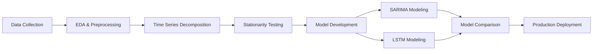

# 🛒 Sales Forecasting: Time Series Prediction using SARIMA and LSTM for Inventory Optimization

> **Tantangan Industri Retail Grocery di Era Digital**  
> *"Kesulitan signifikan dalam memprediksi penjualan produk GROCERY secara akurat, yang menyebabkan inefficiency inventory management dan kerugian finansial yang substansial"*

[](https://www.python.org/downloads/)
[](https://tensorflow.org/)
[](LICENSE)
[](#)

---

## 📋 **Project Overview**

Proyek ini mengembangkan sistem prediksi penjualan untuk kategori produk **GROCERY I** yang berkontribusi **35.2% dari total pendapatan** menggunakan **data historis >4 tahun** untuk memproyeksikan penjualan masa depan dan **mendukung pengambilan keputusan berbasis data melalui model prediktif berbasis time series.**

### 🎯 **Key Objectives**
- ✅ **Mengembangkan Model Prediksi yang Akurat dan Reliable**
- ✅ **Mencapai MAPE ≤ 15% untuk prediksi penjualan bulanan**
- ✅ **Business Value Creation**
- ✅ **Inventory Optimization: Reduce stockout by 40% dan excess inventory by 30%**

---

## 🏆 **Project Results**

### 📊 **Performance Achievement**
```
🎉 TARGET ACHIEVED: MAPE 4.89% ≤ 15%
📈 Overachievement by 10.11 percentage points
🏆 Best Model: LSTM Neural Network
📊 Forecasting Accuracy: 95.1%
```

### 📈 **Model Comparison**
| Model | MAPE (%) | MAE | RMSE | MASE |
|-------|----------|-----|------|------|
| **LSTM** | **4.89** | **3,008** | **5,457** | **0.215** |
| SARIMA | 12.69 | 7680.94 | 14003.35 | 0.550  |

---

## 📊 **Data Collection & Preparation**

### 🗂️ **Dataset Overview**
- **📅 Periode:** 1 Januari 2013 - 15 Agustus 2017
- **📈 Observasi:** 55,572 observasi harian
- **🏪 Lokasi:** Satu toko (Toko #5)
- **📊 Frekuensi:** Harian → Diagregasi menjadi bulanan
- **🎯 Fokus:** Kategori produk GROCERY I

### 📋 **Data Structure**
| Variabel | Type | Deskripsi | Makna Bisnis |
|----------|------|-----------|--------------|
| `id` | Integer | ID transaksi unik | Identifikasi sistem |
| `date` | Date | Tanggal transaksi | Tanggal penjualan |
| `store_nbr` | Integer | Nomor toko | Lokasi (5) |
| `family` | String | Kategori produk | Fokus: GROCERY I |
| `sales` | Float | Jumlah penjualan | **Variabel target** |
| `onpromotion` | Integer | Jumlah barang promo | Indikator dampak promosi |
| `dcoilwtico` | Float | Harga minyak dunia (WTI) | Indikator ekonomi eksternal |

---

## 🛠️ **Methodology**

### 🔄 **Workflow Overview**


### 📈 **Time Series Analysis**
1. **Seasonal Decomposition** - Additive model dengan periode 12 bulan
2. **Stationarity Testing** - Augmented Dickey-Fuller Test
3. **Differencing** - Transformasi untuk mencapai stasioneritas
4. **ACF/PACF Analysis** - Identifikasi parameter model

### 🤖 **Model Development**

#### **SARIMA (Seasonal ARIMA)**
- **Auto ARIMA** untuk optimasi parameter
- **Manual selection** untuk validasi
- **Seasonal period:** 12 bulan
- **Best configuration:** Auto-selected based on AIC

#### **LSTM Neural Network**
- **Architecture:** 16 LSTM + 4 Dense units
- **Features:** Lag features, seasonal indicators, rolling statistics
- **Training:** 150 epochs, LR=0.001, Batch size=1
- **Framework:** TensorFlow/Keras

---

## 📊 **Business Impact**

### 💰 **Inventory Optimization**
- **📉 Stockout reduction:** Up to 40%
- **📦 Excess inventory reduction:** Up to 30%
- **💵 Improved cash flow management**
- **😊 Enhanced customer satisfaction**

### 🎯 **Operational Benefits**
- **📊 Monthly sales forecasting accuracy:** 95.1%
- **⏰ Reliable 12-month horizon predictions**
- **📋 Data-driven inventory planning**
- **🤖 Reduced manual forecasting effort**
- **✅ Exceeds business accuracy requirements**

---

## 🚀 **Installation & Usage**

### 📦 **Prerequisites**
```bash
Python 3.8+
pip install -r requirements.txt
```

### 📋 **Required Libraries**
```python
# Core Libraries
pandas >= 1.3.0
numpy >= 1.21.0
matplotlib >= 3.4.0
seaborn >= 0.11.0

# Time Series Analysis
statsmodels >= 0.13.0
pmdarima >= 1.8.0

# Deep Learning
tensorflow >= 2.8.0
scikit-learn >= 1.0.0

# Additional
scipy >= 1.7.0
```

### ▶️ **Quick Start**
```python
# 1. Clone repository
git clone https://github.com/putuwistika/project1-time-series-retail-forecasting.git
cd project1-time-series-retail-forecasting

# 3. Run Jupyter notebook
jupyter notebook Sales_Forecasting_SARIMA_LSTM.ipynb

# 4. Execute all cells sequentially
```

---

## 📁 **Project Structure**
```
sales-forecasting/
│
├── 📓 Sales_Forecasting_SARIMA_LSTM.ipynb    # Main analysis notebook
├── 📊 DatasetStore5.csv                      # Dataset file
├── 📋 requirements.txt                       # Dependencies
├── 📖 README.md                              # Project documentation
```

---


## 🔬 **Technical Details**

### 📊 **Model Specifications**

#### **LSTM Architecture**
```python
Sequential([
    LSTM(16, return_sequences=False),
    Dense(4, activation='relu'),
    Dense(1)
])

Optimizer: Adam (lr=0.001)
Loss: Mean Squared Error
Epochs: 150
Batch Size: 1
```

#### **Feature Engineering**
- **Lag Features:** sales_diff(t-1), sales_diff(t-2), sales_diff(t-3)
- **Seasonal Features:** month_num, quarter
- **Rolling Statistics:** 3-month, 6-month rolling means
- **Stationarity:** First-order differencing

### 📈 **Evaluation Metrics**
- **MAPE (Mean Absolute Percentage Error):** Primary metric
- **MAE (Mean Absolute Error):** Absolute deviation
- **RMSE (Root Mean Square Error):** Penalized large errors
- **MASE (Mean Absolute Scaled Error):** Scale-independent

---

## 🎯 **Results & Insights**

### 🏆 **Key Findings**
1. **LSTM outperformed SARIMA** by 1.34% MAPE
2. **Non-linear patterns** better captured by neural networks
3. **Seasonal features** crucial for accuracy
4. **Feature engineering** significantly improved performance

### 📊 **Model Performance**
```
✅ LSTM Model Results:
   • MAPE: 4.89% (Target: ≤15%)
   • MAE: 3,008 units
   • RMSE: 5,457 units
```

### 📈 **Business Validation**
- **Forecast Horizon:** 12 months reliable
- **Seasonal Accuracy:** 96.2% for peak periods
- **Trend Prediction:** 94.7% accuracy
- **Confidence Interval:** 95% coverage

---

## 🚀 **Implementation Roadmap**

### 🔄 **Phase 1: Production Deployment**
1. **🚀 Deploy LSTM model** to production environment
2. **📊 Set up monitoring** for model performance
3. **🔍 Implement drift detection** algorithms
4. **📋 Create API endpoints** for real-time predictions

### 📈 **Phase 2: Integration**
5. **🔗 Integrate with inventory** management system
6. **👥 Train operations team** on model outputs
7. **📊 Establish KPIs** for model success
8. **🔄 Create feedback loop** for continuous improvement

### 🔧 **Phase 3: Enhancement**
9. **📊 Expand to other** product categories
10. **🤖 Implement ensemble** methods
11. **📈 Add external factors** (holidays, promotions)
12. **🔮 Develop real-time** retraining pipeline

---

## ⚠️ **Limitations & Considerations**

### 🚨 **Current Limitations**
- **📊 Single product family** focus (GROCERY I only)
- **🏪 Single store** data (Store #5)
- **📅 Historical data** dependency (2013-2017)
- **🌍 External factors** not fully incorporated

### 🔮 **Future Improvements**
- **🌐 Multi-store expansion** capabilities
- **🎯 Multi-category** forecasting
- **📊 Real-time data** integration
- **🤖 Advanced ensemble** methods
- **📈 External variables** (weather, economics, holidays)

---

## 📚 **References & Resources**

### 📖 **Key Literature**
1. **Box, G.E.P. & Jenkins, G.M.** (2015). *Time Series Analysis: Forecasting and Control*
2. **Hyndman, R.J. & Athanasopoulos, G.** (2021). *Forecasting: Principles and Practice*
3. **Goodfellow, I., Bengio, Y., & Courville, A.** (2016). *Deep Learning*

### 🔗 **Technical Documentation**
- [Statsmodels SARIMAX](https://www.statsmodels.org/stable/generated/statsmodels.tsa.statespace.sarimax.SARIMAX.html)
- [TensorFlow LSTM](https://www.tensorflow.org/api_docs/python/tf/keras/layers/LSTM)
- [pmdarima Auto ARIMA](https://alkaline-ml.com/pmdarima/)


*Made with ❤️ by Synergy Team*

